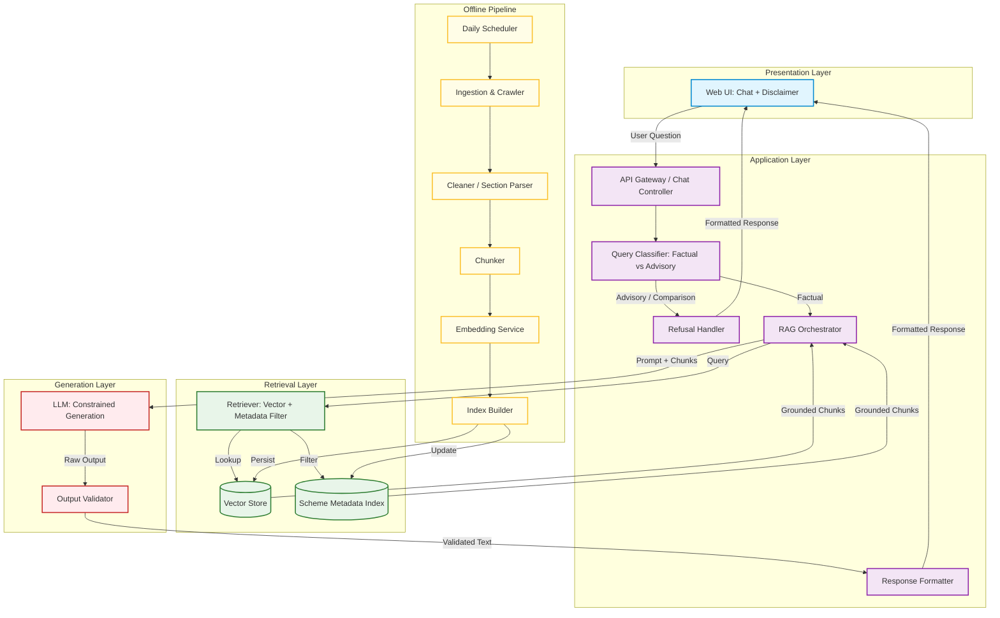
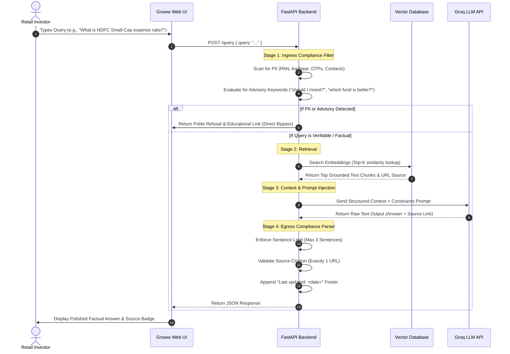

# System Architecture: Mutual Fund FAQ Assistant

This document defines the high-level architecture, component designs, compliance protocols, and data pipelines for the **Mutual Fund FAQ Assistant** (Facts-Only Q&A). The system is designed to provide compliant, lightweight, and source-backed answers inside a **Groww-inspired** product context.

---

## 🏛️ High-Level Architecture

The FAQ Assistant is designed around a strictly layered architecture separating user presentation, stateless application orchestration, factual semantic retrieval, constrained generation, and automated offline data indexing.



---

### 🎨 1. Presentation Layer
* **Web UI (Chat + Disclaimer)**: Lightweight mobile-responsive single-page app displaying a conversational interface, interactive factual presets, and a persistent compliance footer banner: `"Facts-only. No investment advice."`

### ⚙️ 2. Application Layer
* **API Gateway / Chat Controller**: Coordinates the incoming requests and serves as the single ingress API.
* **Query Classifier (Factual vs Advisory)**: Inspects queries for sensitive metrics, PII leaks, or advisory intention.
* **Refusal Handler**: Intercepts advisory/comparative intents, returns educational resources, and enforces system compliance parameters.
* **RAG Orchestrator**: Manages state, controls retrieval flow, builds prompts, and manages context injection.
* **Response Formatter**: Polishes responses, structures citations, and appends the update timestamps.

### 🔍 3. Retrieval Layer
* **Retriever (Vector + Metadata Filter)**: Performs similarity semantic queries on vector spaces, filtered by metadata boundaries.
* **Vector Store**: Persists raw text chunk embeddings locally or in-memory (FAISS/ChromaDB).
* **Scheme Metadata Index**: Indexes URL sources, dates, and scheme parameters for exact compliance checks.

### 🧠 4. Generation Layer
* **LLM (Constrained Generation)**: Uses state-of-the-art LLM models with highly restricted system prompt constraints.
* **Output Validator**: Egress validator enforcing sentence lengths and source citations boundaries before transmission.

### 🔄 5. Offline Ingestion Pipeline
* **Daily Scheduler**: Cron trigger initiating scraping pipelines.
* **Ingestion & Crawler**: Scraping script targeting the 17 verified HDFC URLs.
* **Cleaner / Section Parser**: HTML sanitizer extracting metadata grids and clean content.
* **Chunker**: Text splitter parsing content recursively into 384-character chunks.
* **Embedding Service**: Local sentence embedding encoder converting text into numerical vectors.
* **Index Builder**: Compiles, registers, and performs atomic swapping of indices.

---

### 🧭 Execution Pipelines

* **Request Path (Online)**:
  `User question` ➔ `Classify (Factual vs Advisory)` ➔ `Retrieve relevant chunks (Retriever)` ➔ `Generate grounded answer (Constrained LLM)` ➔ `Validate output` ➔ `Format response` ➔ `Display in UI`

* **Index Path (Offline)**:
  `Daily Scheduler triggers pipeline` ➔ `Ingest 17 HDFC Mutual Fund pages` ➔ `Parse into structured sections (Cleaner)` ➔ `Recursive chunking` ➔ `Generate embeddings` ➔ `Persist to vector store and scheme metadata index`

---

## 🔁 Complete Data Flow Sequence

Every request is evaluated along a highly secure, non-custodial pipeline that prioritizes **safety and factuality** over intelligence:



---

## 🧩 Core Architecture Components

### 1. Ingress Compliance & Query Router
* **PII Sanitizer**: Regex and Named Entity Recognition (NER) filters identify sensitive inputs (PAN, Aadhaar, emails, account/card numbers). If PII is found, the system immediately drops the request with a warning to safeguard user privacy.
* **Advisory Guardrail**: Uses keyword clustering (e.g., *"buy, sell, invest, better, returns, profit, compare"*) combined with a lightweight zero-shot classification model. If the query asks for recommendations or opinions, the router bypasses retrieval and routes directly to the **Refusal Handler**.
* **Performance Bypass**: Queries asking for returns or historical performance calculations are redirected, returning a direct link to the **Official HDFC Factsheet** rather than letting the LLM hallucinate complex return calculations.

### 2. Semantic Retriever
* **Vector Store**: A lightweight, file-based vector database (such as **FAISS** or **Chroma**) operating locally or in-memory, keeping memory usage **under 50MB**.
* **Ingestion Pipeline**: Processes the 17 verified HDFC URLs by parsing the raw HTML, chunking content cleanly (250–500 tokens), generating embeddings using a fast sentence-transformer model (e.g., `all-MiniLM-L6-v2`), and writing index metadata containing the source URL.

### 3. LLM Orchestration Engine
Constructs the strict system prompt that instructs the LLM to behave as a factual dictionary:
```text
SYSTEM PROMPT CONTEXT:
You are a facts-only mutual fund assistant. 
You are given the following verified HDFC Mutual Fund context:
[CONTEXT BLOCKS]

RULES:
1. Answer the user query using ONLY the verified context.
2. If the context does not contain the answer, politely refuse and state the facts-only scope.
3. Strictly limit your response to a maximum of 3 sentences.
4. Provide exactly one source URL from the context at the very end of the answer.
5. NEVER provide investment advice, comparison ratings, or returns calculations.
```

### 4. Egress Post-Parser & Output Compliance Validator
* **Length Guard**: Splits the generated string into sentences. If the length exceeds 3 sentences, it truncates the answer to the top 3 and logs a warning.
* **Citation Validator**: Scans the text for URLs. Assures that exactly one URL is present and matches the HDFC URL metadata index.
* **Metadata Footer**: Automatically appends the static footer containing the ingestion update date: `“Last updated from sources: <date>”`.

---

## 🔄 Ingestion, Cleaning & Chunking Pipeline

To keep the mutual fund knowledge base accurate and updated without degrading query performance, a background ingestion pipeline executes under a strict cron schedule.

### 1. Ingress Scheduler (Daily Trigger)
* **Trigger Mechanism**: An in-app task scheduler (such as `APSTasks` running statefully in the FastAPI thread, or a serverless worker via GitHub Actions) is programmed to fire **daily at 00:00 UTC**.
* **Action**: Initiates the data scraping client to fetch the HTML body of all 17 registered HDFC Mutual Fund explore and factsheet URLs.
* **Update Log**: Writes the date of the execution to the database metadata index. This timestamp is dynamically read by the **Egress compliance post-parser** to populate the footer `“Last updated from sources: <date>”`.

### 2. Data Cleaning & Sanitization Process
Raw HTML contains substantial layout noise (e.g., stylesheets, trackers, layout grids, site navigation headers, and promotional cookie banners) that pollutes vector semantic search.
* **Tag Stripping**: The parser isolates the target page grid (e.g., `<article>` or `div#fund-details`) and strips elements such as `<nav>`, `<footer>`, `<script>`, `<style>`, and standard `iframe` components.
* **Text Normalization**:
  * Character normalization converts raw HTML entities (e.g., `&amp;`, `&nbsp;`, `&#8377;`) into standard UTF-8 text (e.g., `&`, space, `₹`).
  * White-space collapsing collapses multiple continuous linebreaks, tab spacings, and double spaces into clean, standardized single gaps.
* **PII & Custom Scraping Checks**: Scrapes only high-level public scheme matrices (expense ratios, manager names, entry/exit load details). No private user accounts or tracker forms are scraped.

### 3. Data Chunking & Text Splitting Strategy
Mutual fund details are tabular or paragraph-structured. Traditional naive character chunking breaks continuous numerical facts (e.g., separating *"exit load"* from its percentage parameter *“1.00%”*).
* **Splitting Strategy**: A **Recursive Character Text Splitter** is deployed. It splits text using a descending list of target characters:
  1. `\n\n` (Double Newlines — separating structural content sections/paragraphs)
  2. `\n` (Single Newlines — separating lists or table rows)
  3. `.` (Periods — separating sentences)
  4. ` ` (Spaces — separating words)
* **Hyperparameters**:
  * **Chunk Size**: `384` characters/tokens. This limits context block size to preserve facts without embedding unrelated information.
  * **Chunk Overlap**: `80` characters/tokens. Maintains sentence context across chunk boundaries, ensuring keyword searches (e.g., *"HDFC Large Cap Fund exit load"*) remain semantically continuous.
* **Vector Index Upsert**: Chunks are processed into dense vectors and written to the local Vector Database. If the transaction completes successfully, the active indices are atomically swapped to avoid any service downtime.

---

## 🔒 Security, Compliance, & Non-Functional Design

> [!CAUTION]
> **PII Zero-Retention & Zero-Storage**
> The backend server runs completely statelessly. User queries are processed in memory and never logged, cached, or written to external storage. This strictly complies with SEBI and GDPR privacy guidelines regarding non-custodial handling of user data.

> [!IMPORTANT]
> **Advisory Safety (SEBI Compliance)**
> To avoid regulatory compliance issues, the model is strictly sandboxed. Under no circumstances will it recommend HDFC funds over others, nor will it generate return estimates. It only serves as a natural-language search interface for official, static documents.

> [!TIP]
> **Memory Optimization for Free Tier Deployments**
> The application will run cleanly under **512MB RAM** by using:
> * Pre-calculated semantic embeddings cached inside lightweight `.bin` or `.db` files.
> * Minimal local packages (avoiding bulky libraries like full-weight PyTorch/Tensorflow).
