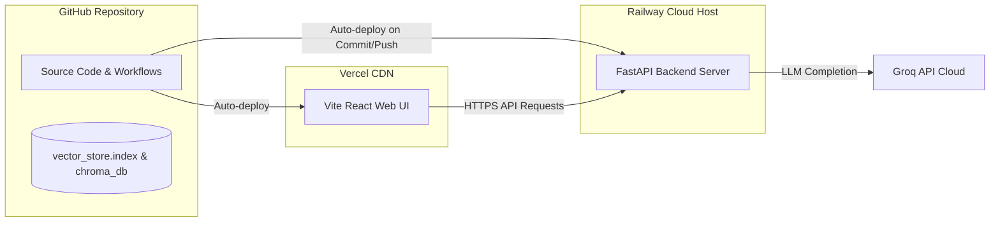

# Deployment Plan: Mutual Fund FAQ Assistant

This document outlines the step-by-step production deployment procedure for the **Mutual Fund FAQ Assistant** (Facts-Only Q&A) architecture. The deployment isolates the stateful/computational FastAPI backend on **Railway** and serves the Groww-inspired React frontend on **Vercel**.

---

## 🌐 Production Architecture Overview

The production deployment consists of three main components working in synchrony:

1. **Backend API Gateway (FastAPI)**: Deployed to **Railway** inside a stateless container environment, loading the SentenceTransformer CPU embeddings model and routing user queries.
2. **Frontend UI (React + Vite)**: Deployed to **Vercel** as a static single-page application (SPA), served via a global CDN.
3. **Automated Ingestion (GitHub Actions)**: Runs daily at 10:00 AM IST on GitHub runners, rebuilds the vector index database, and pushes it back to GitHub. This push automatically triggers a Railway redeployment to pull the updated data.

---

## ⚙️ Prerequisites & Setup

* **GitHub Repository**: [Swadeepthi-V/RAG-Chatbot](https://github.com/Swadeepthi-V/RAG-Chatbot) must be linked to both your Railway and Vercel accounts.
* **API Credentials**: You need your **Groq Cloud API Key** (obtainable from [console.groq.com](https://console.groq.com)).

---

## 1. Backend Deployment (Railway)

Railway is used for the backend FastAPI container since it handles Python runtimes, installs dependencies automatically, and supports custom environment configurations.

### Setup Instructions
1. Log in to [Railway.app](https://railway.app) and create a **New Project**.
2. Select **Deploy from GitHub repo** and choose `Swadeepthi-V/RAG-Chatbot`.
3. Railway will automatically detect the [Dockerfile](file:///c:/RAG%20chatbot/Dockerfile) at the root of the repository and use it to compile the C++ dependencies and build the container, bypassing the default Railpack builder.
4. Keep the default settings in your Railway service dashboard:
   * **Root Directory**: `./` (leave as default)
   * **Build Command**: Leave empty (handled automatically by the Dockerfile build process)
   * **Start Command**: Leave empty (handled automatically by the Dockerfile CMD directive)

### Required Environment Variables
Configure these variables in the **Variables** tab of your Railway service:

| Variable | Value | Description |
|---|---|---|
| `HOST` | `0.0.0.0` | Exposes the server to external requests. |
| `PORT` | `8000` | Internally mapped by Railway (automatic). |
| `PYTHONPATH` | `src/app` | Resolves relative Python imports in `main.py`. |
| `GROQ_API_KEY` | `your_actual_groq_api_key` | Copy the API key from your local `.env` file. |
| `DATA_CACHE_PATH` | `./data/vector_store.index` | Path to the active database index. |
| `INDEX_UPDATE_DATE` | `03-Jun-2026` | Default date (updated dynamically). |
| `DISABLE_LOCAL_SCHEDULER` | `true` | Disables the local python daemon scheduler thread, delegating to the GitHub Actions workflow. |

Once configured, Railway will build the Docker container and deploy the backend, generating a public URL (e.g., `https://rag-chatbot-production.up.railway.app`). **Copy this URL for the frontend setup.**

---

## 2. Frontend Deployment (Vercel)

Vercel hosts the static React/Vite web application on its global edge network.

### Setup Instructions
1. Log in to [Vercel.com](https://vercel.com) and click **Add New > Project**.
2. Import the `Swadeepthi-V/RAG-Chatbot` repository.
3. Configure the Project settings:
   * **Framework Preset**: Select `Vite`.
   * **Root Directory**: Set to `frontend`.
   * **Build and Output Settings**:
     * Build Command: `npm run build`
     * Output Directory: `dist`
     * Install Command: `npm install` (default)

### Required Environment Variables
Under the **Environment Variables** section, add:

| Key | Value | Description |
|---|---|---|
| `VITE_API_URL` | `https://your-backend-url.up.railway.app` | The public URL generated by Railway (no trailing slash). |

4. Click **Deploy**. Vercel will build the frontend, inject the production API URL, and serve the application globally.

---

## 🔄 Automated Database Sync Pipeline

Since the vector database index is stored in the gitignored `data/` folder locally, we use a GitHub Actions workflow to run the ingestion pipeline off-site:

1. **Daily Trigger**: The GitHub Actions scheduler runs [daily_indexing.yml](file:///c:/RAG%20chatbot/.github/workflows/daily_indexing.yml) daily at 10:00 AM IST.
2. **Rebuilding the Index**: The runner crawls the 17 HDFC source pages, cleans and chunks the text, and compiles a fresh index database.
3. **Pushed to GitHub**: The workflow force-adds (`git add -f`) the compiled binary index files (`vector_store.index`, `vector_store.meta`, and `chroma_db/`) and pushes them to the `main` branch.
4. **Auto-Redeploy**: Railway detects the new commit on `main`, pulls the latest code and the updated index files, and automatically rebuilds/redeploys the FastAPI server.
5. **Zero Downtime**: The entire cycle completes automatically in under 2 minutes, ensuring your production RAG database stays updated daily with zero downtime or manual builds.
