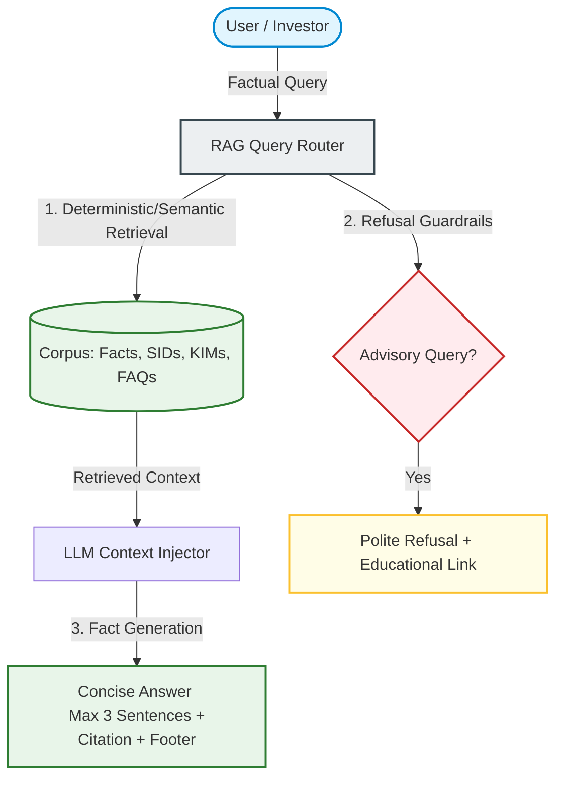

# Problem Statement: Mutual Fund FAQ Assistant (Facts-Only Q&A)

Build a highly reliable, transparent, and compliant facts-only FAQ assistant for mutual fund schemes, utilizing **Groww** as the reference product context. The assistant will answer objective, verifiable queries by retrieving information exclusively from official public sources.

---

## 🎯 Project Overview & Objective

The goal is to design and implement a lightweight **Retrieval-Augmented Generation (RAG)** assistant that provides direct, factual responses to user queries about mutual fund schemes. 

The system must strictly avoid providing investment advice, opinions, or subjective recommendations. Every response must be objective, extremely concise, and accompanied by a single, verifiable citation link to the official source.

---

## 👥 Target Users

* **Retail Investors**: Individuals looking to verify or compare specific, objective mutual fund criteria (e.g., exit loads, lock-ins, expense ratios).
* **Customer Support & Content Teams**: Teams handling repetitive, factual queries about mutual fund schemes who need instant access to source-backed details.

---

## 📋 Scope of Work

### 1. Corpus Definition
The curated knowledge base targets **HDFC Mutual Fund** as the selected Asset Management Company (AMC). The corpus consists of the following **17 official public URLs**:

* **NAV & IDCW Tracking**: [hdfcfund.com/nav-and-idcw](https://www.hdfcfund.com/nav-and-idcw)
* **Scheme Factsheets**: [hdfcfund.com/mutual-funds/factsheets](https://www.hdfcfund.com/mutual-funds/factsheets)
* **Scheme Portfolios (Monthly/Fortnightly)**: [hdfcfund.com/downloads/monthly-fortnightly-scheme-portfolio](https://www.hdfcfund.com/downloads/monthly-fortnightly-scheme-portfolio)
* **Total Expense Ratio (TER)**: [hdfcfund.com/investors/total-expense-ratio](https://www.hdfcfund.com/investors/total-expense-ratio)
* **Mutual Funds Blog Portal**: [hdfcfund.com/learn/blog](https://www.hdfcfund.com/learn/blog)
* **What is NAV?**: [hdfcfund.com/learn/blog/what-nav-mutual-funds](https://www.hdfcfund.com/learn/blog/what-nav-mutual-funds)
* **Open vs. Close-Ended Schemes**: [hdfcfund.com/learn/blog/what-are-open-ended-and-close-ended-mutual-fund-schemes](https://www.hdfcfund.com/learn/blog/what-are-open-ended-and-close-ended-mutual-fund-schemes)
* **Debt Schemes Guide**: [hdfcfund.com/learn/blog/understanding-debt-mutual-fund-schemes-meaning-and-how-they-work](https://www.hdfcfund.com/learn/blog/understanding-debt-mutual-fund-schemes-meaning-and-how-they-work)
* **About Us**: [hdfcfund.com/about-us](https://www.hdfcfund.com/about-us)
* **Downloads & Request Forms**: [hdfcfund.com/downloads/forms](https://www.hdfcfund.com/downloads/forms)
* **Investor Support & Relationship Officer**: [hdfcfund.com/contact-us/investor-relationship-officer](https://www.hdfcfund.com/contact-us/investor-relationship-officer)
* **HDFC Mid-Cap Fund (Direct)**: [hdfcfund.com/explore/mutual-funds/hdfc-mid-cap-fund/direct](https://www.hdfcfund.com/explore/mutual-funds/hdfc-mid-cap-fund/direct)
* **HDFC Large-Cap Fund (Direct)**: [hdfcfund.com/explore/mutual-funds/hdfc-large-cap-fund/direct](https://www.hdfcfund.com/explore/mutual-funds/hdfc-large-cap-fund/direct)
* **HDFC Large & Mid-Cap Fund (Direct)**: [hdfcfund.com/explore/mutual-funds/hdfc-large-and-mid-cap-fund/direct](https://www.hdfcfund.com/explore/mutual-funds/hdfc-large-and-mid-cap-fund/direct)
* **HDFC Small-Cap Fund (Direct)**: [hdfcfund.com/explore/mutual-funds/hdfc-small-cap-fund/direct](https://www.hdfcfund.com/explore/mutual-funds/hdfc-small-cap-fund/direct)
* **HDFC Gold ETF Fund (Direct)**: [hdfcfund.com/explore/mutual-funds/hdfc-gold-etf-fund-fund/direct](https://www.hdfcfund.com/explore/mutual-funds/hdfc-gold-etf-fund-fund/direct)
* **HDFC Silver ETF Fund (Direct)**: [hdfcfund.com/explore/mutual-funds/hdfc-silver-etf-fund-fund/direct](https://www.hdfcfund.com/explore/mutual-funds/hdfc-silver-etf-fund-fund/direct)

### 2. FAQ Assistant Requirements
The assistant must dynamically extract facts and respond under strict formatting constraints:
* **Factual Scope**: Respond only to verifiable parameters:
  * Expense ratio & exit load structures
  * Minimum SIP / lump sum investment amounts
  * **ELSS** lock-in periods
  * Riskometer classifications
  * Benchmark indices
  * **Fund management data** (e.g., Fund Manager names, tenure, active scheme assignments, and background)
  * Steps to download account/capital gains statements
* **Response Constraints**:
  * **Length**: Strictly limited to a maximum of **3 sentences**.
  * **Citations**: Include exactly **one citation link** referencing the source.
  * **Footer**: Every response must conclude with:  
    `"Last updated from sources: <date>"`

### 3. Refusal Handling & Guardrails
If a user submits an advisory, subjective, or non-factual query (e.g., *"Should I invest in this fund?"* or *"Which fund is better?"*):
* **Refuse gracefully**: Present a polite, standard refusal clearly reinforcing the facts-only constraint.
* **Educate**: Provide a link to an official educational resource (e.g., AMFI or SEBI investor education pages).

### 4. Minimalist User Interface
A clean, minimal interface representing the Groww-inspired product context:
* **Welcome Message**: Directing users on how to query the assistant.
* **Quick Presets**: 3 interactive example questions to demonstrate facts-only capability.
* **Disclaimer Banner**: Highly visible warning: `"Facts-only. No investment advice."`

---

## 🔒 Constraints & Compliance

> [!CAUTION]
> **Strict Privacy & PII Guardrails**
> The system must **never** collect, store, or process sensitive personal data:
> * PAN or Aadhaar numbers
> * Bank Account numbers
> * OTPs / passwords
> * Email addresses or phone numbers

> [!WARNING]
> **Content Restrictions**
> * Absolutely **no investment advice**, return predictions, or qualitative recommendations.
> * No performance comparisons or custom return calculations. 
> * For performance-related queries, the assistant must only return a direct link to the official AMC factsheet.

> [!IMPORTANT]
> **Source Credibility**
> Rely exclusively on official public sources (AMC, AMFI, SEBI). **Do not** scrape or fetch data from third-party blogs, news outlets, or financial aggregators.

---

## 📦 Expected Deliverables

1. **README Document**:
   * Complete setup and running instructions.
   * Documentation of the selected AMC and schemes.
   * Deep dive into the RAG architecture and retrieval strategy.
   * Log of known limitations.
2. **Disclaimer Snippet**:
   * Globally visible disclaimer: `"Facts-only. No investment advice."`

---

## 🏆 Success Criteria

* **Accurate Retrieval**: Flawless extraction of precise numerical/factual mutual fund parameters.
* **Strict Factuality**: Zero advisory leakage or subjective comments.
* **Consistent Citations**: Every single fact is cited back to a valid official source link.
* **Guardrail Enforcement**: Smooth, polite refusal of speculative or advisory queries.
* **Clean UI**: A minimal, responsive interface with easy-to-use search and quick-question presets.
